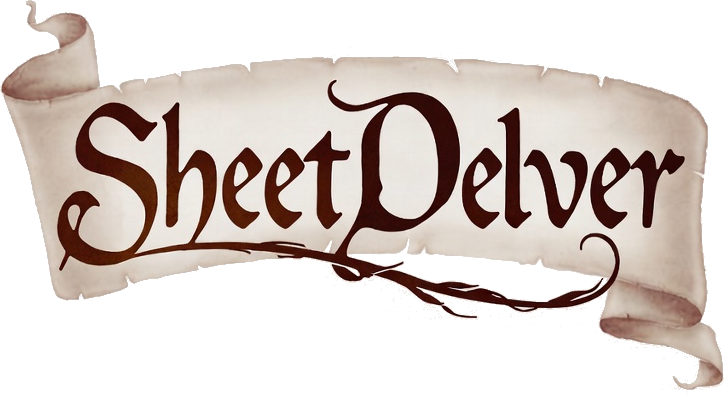

[](https://github.com/juvinious/sheet-delver/actions/workflows/ci.yml)

A modern, external character sheet interface for Foundry VTT.

## Current Features
- **Shadowdark RPG Support**: Full support for Shadowdark character sheets with a clean, modern UI.
- **Auto-Calculations**: Automatic calculation of Stats, HP, AC, and Inventory flexibility.
- **Inventory Management**: Drag-and-drop equipment, slot tracking, and toggleable states (Equipped/Stashed/Light).
- **Interactive Toggles**: Custom icons for managing item states directly from the inventory list.
- **Formatted Chat**: Rich chat messages for rolls and abilities with inline roll buttons.
- **Mobile Friendly**: optimized touch targets and layout.

## Future Roadmap
- **System Extensibility**: Plugin architecture to easily add support for 5e, Pathfinder, and other systems.
- **Character Builder**: 'CharacterForge' style builder for creating new characters step-by-step.
- **Module Integration**: Better integration with core Foundry modules.

## Usage

### Requirements
- **Node.js**: 18+
- **Foundry VTT**: Valid instance (v13+ required)

### Configuration
Create a `settings.yaml` file in the root directory to configure the connection to your Foundry instance.

```yaml
# Application Server Settings
app:
    host: localhost       # Hostname to bind to
    port: 3000            # Port to run on
    protocol: http        # Protocol (http/https)
    chat-history: 100     # Number of chat messages to load

# Foundry VTT Connection
foundry:
    host: foundry.example.com
    port: 30000
    protocol: https

# Debug Configuration
debug:
    enabled: true        # Enable debug logging
    level: 4             # 0=None, 1=Error, 2=Warn, 3=Info, 4=Debug
    foundryUser:
        name: Gamemaster
        password: password
```

### Running Locally
To run the application locally for personal use:

1.  Current directory:
    ```bash
    npm run build
    npm start
    ```
2.  Open [http://localhost:3000](http://localhost:3000).

### Deployment
To deploy on a dedicated server:

1.  Clone the repository.
2.  Install dependencies: `npm install`
3.  Build the application: `npm run build`
4.  Start the server: `npm start`
    - *Note: You may want to use a process manager like PM2 to keep it running.*

## Development
For developers interested in contributing to **SheetDelver**, please refer to [CONTRIBUTING.md](CONTRIBUTING.md) for detailed setup instructions, architecture overview, and guidelines.


