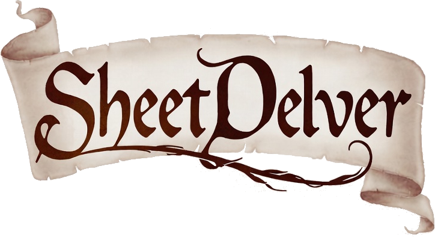
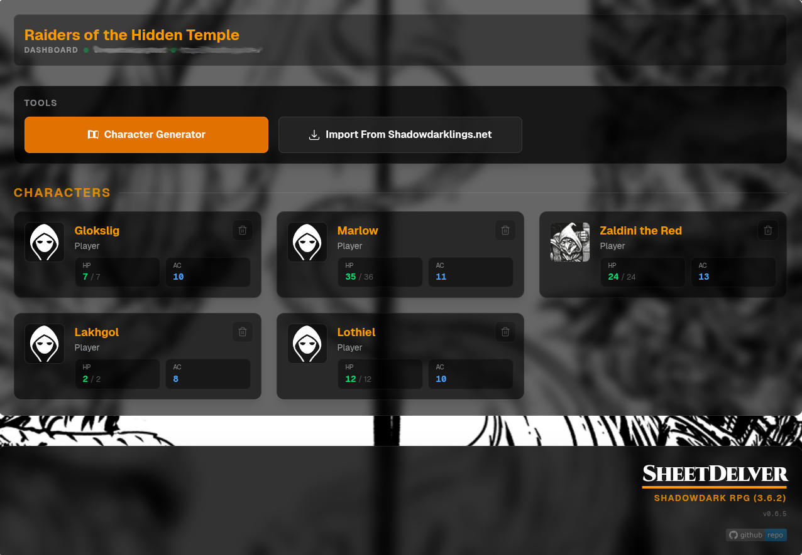
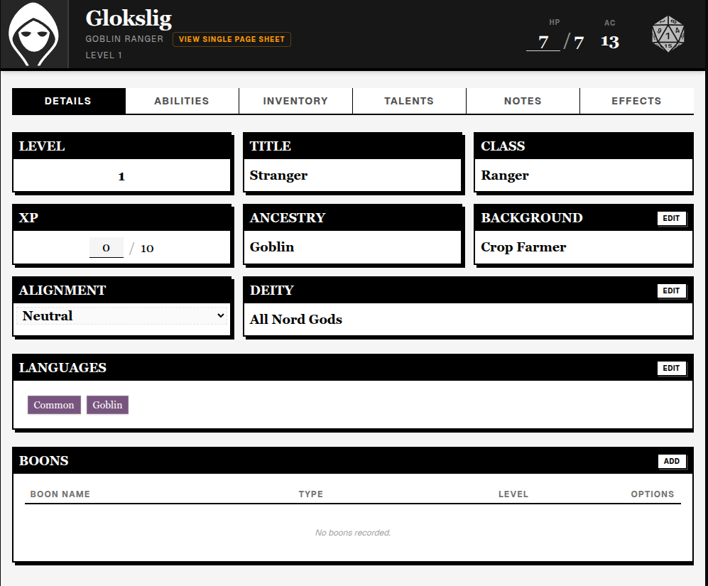
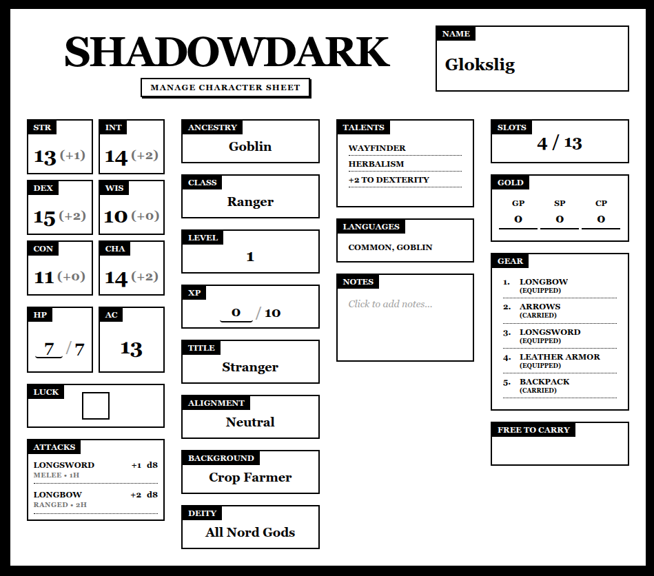
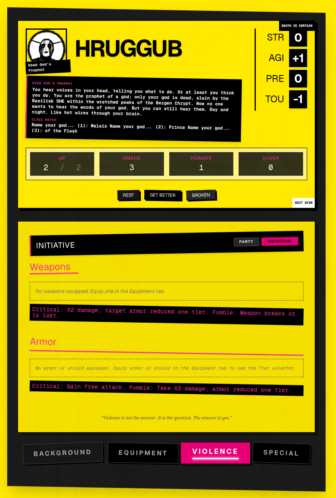

[](https://github.com/juvinious/sheet-delver)
[](https://github.com/juvinious/sheet-delver/actions/workflows/ci.yml)

A modern, external character sheet interface for [Foundry VTT](https://foundryvtt.com/).

## Key Features
- **Character Sheets**: Custom designed sheets by system, see below for supported systems.
- **Real-Time Interactions**: Instant display of images and journals shared by the GM ("Show to Players"), with support for both broadcast and targeted sharing.
- **Rich Journal Browser**: Advanced journal viewing with folder support, rich text rendering, and pagination.
- **Mobile Friendly**: Optimized touch targets and responsive layouts.

## Commonly Shared Features
- **Dashboard**: Initial view and shared amongst all supported systems. It will display a users owned actors and additional tools (if implemented) such as for creating or importing characters.
- **Chat**: A common chat interface for all systems. It will display a users chat messages and allow them to send messages to the GM. It will also display a list of active players and their connection status.
- **Dice Roller**: Universal dice roller modeled after the dice tray module for Foundry VTT. 
- **Combat Tracker**: Combat tracker HUD that displays at top whenever the system detects an active combat. It allows for rolling initiative and ending turn.



## Supported Systems

### Shadowdark RPG
While not yet feature-complete, SheetDelver offers robust support for Shadowdark:
- **Character Sheets**: Full support for Shadowdark character sheets with a clean, modern UI.
- **Auto-Calculations**: Automatic calculation of Stats, HP, AC, and Inventory flexibility.
- **Inventory Management**: Drag-and-drop equipment, slot tracking, and toggleable states (Equipped/Stashed/Light).
- **Treasure & Wealth**: Dedicated section for treasure items with total wealth tracking and "Sell" functionality.
- **Gear Selection**: Integrated compendium browser for quickly adding standard gear, armor, and weapons.
- **Interactive Toggles**: Custom icons for managing item states directly from the inventory list.
- **Formatted Chat**: Rich chat messages for rolls and abilities with inline roll buttons.
- **Character Import**: Import characters via JSON from Shadowdarklings.
- **Level Up Wizard**: Guided level-up process with talent/boon rolling and choice resolution.



### Mörk Borg
SheetDelver provides dedicated support for the Mörk Borg RPG system:
- **Character Sheets**: Full character sheet with the signature Mörk Borg aesthetic — yellow, black, and pink brutalist design.
- **Ability Rolls**: Click any ability (STR/AGI/PRE/TOU) to open a roll confirmation modal showing the resolved formula before dispatching.
- **Roll Modal**: Generic confirmation dialog for all rollable actions — shows formula, optional DR, and roll mode selector (Public/GM Only/Blind/Self).
- **Feats & Scrolls**: Formula feats roll via the modal with resolved `@ability` values; macro feats (e.g. Brew Decoctions) trigger immediately; passive feats display only.
- **Violence Tab**: Equipped weapons and armor only — with Attack/Defend roll buttons using the full automated sequence.
- **Custom Chat Cards**: Styled Mörk Borg chat cards for all roll outcomes (ability tests, feat rolls, attacks, defense, initiative, broken, get better, decoctions).
- **Get Better**: Automated sequence rolling HP, all four abilities, and debris — including auto-creating found scrolls in the actor's inventory.
- **Equipment Management**: Full inventory with quantity controls, equip/carry toggles, and an **Organize Inventory** button that merges duplicate items.
- **Rest System**: Rest modal with food/drink condition tracking, infection handling, and HP recovery rolls.
- **Spend Omen**: Omen spending with outcome reminder card.
- **Broken & Initiative**: Broken condition rolls and individual/party initiative.


## Planned System Support
- **D&D 5e**: Planned...
- **PF2E**: Planned...

## Architecture
SheetDelver follows a **Hardened 4-Folder Root** architecture with a strict **Logic Firewall**:

1.  **Client Shell** (`src/client` | `@client`): A pure frontend environment (Next.js/React). Strictly forbidden from importing Node.js globals.
2.  **Server Core** (`src/server` | `@server`, `@core`): A dedicated Express API and Foundry socket bridge. Manages per-user session proxying.
3.  **Shared Layer** (`src/shared` | `@shared`): Environment-agnostic interfaces, constants, and pure utilities safe for both browser and server.
4.  **System Modules** (`src/modules` | `@modules`): Pluggable RPG system logic. Each module enforces its own internal client/server isolation.
5.  **Execution App** (`src/app` | `@app`): The Next.js App Router entry point.
6.  **Admin CLI** (`src/cli`): Command-line tool for world management and setup.

---

## Usage

### Requirements
- **Node.js**: 18+
- **Foundry VTT**: Valid instance (v13+ recommended)

### Configuration
Create a `settings.yaml` file in the root directory. This file is ignored by git.

```yaml
# settings.yaml
app:
    host: localhost      # Hostname for the SheetDelver application
    port: 3000           # Port for SheetDelver to listen on
    protocol: http       # Protocol for SheetDelver (http/https)
    chat-history: 100    # Max number of chat messages to retain/display

foundry:
    host: foundryserver.local # Hostname of your Foundry VTT instance
    port: 30000               # Port of your Foundry VTT instance
    protocol: http            # Protocol (http/https)
    connector: socket         # 'socket' (Headless Sockets)
    username: "gamemaster"    # Required for Headless connection
    password: "password"      # Required for Headless connection
    # Optional: Path to Foundry Data directory for direct world import
    # foundryDataDirectory: "/path/to/foundryuserdata"

debug:
    enabled: true        # Enable debug logging
    level: 3             # Log level (0=None, 1=Error, 2=Warn, 3=Info, 4=Debug)

security:
    rate-limit:
        enabled: true           # Enable/disable login rate limiting
        window-minutes: 15      # Time window in minutes
        max-attempts: 5         # Maximum login attempts per window
    body-limit: 10mb            # Maximum JSON request body size (for large character imports)
    cors:
        allow-all-origins: false
        allowed-origins:
            - http://localhost:3000
    service-token: "replace-with-strong-random-token"  # Internal privileged bearer token (not a Foundry password)
```

The `security.service-token` value is used only for internal privileged API bearer flows. Do not reuse your Foundry account password.

You can generate a strong token with either command:

```bash
openssl rand -hex 32
```

```bash
node -e "console.log(require('node:crypto').randomBytes(32).toString('hex'))"
```

Environment override is supported via `APP_SERVICE_TOKEN`.

CORS policy is allow-list based by default and shared by Express + Socket.io:
- `security.cors.allowed-origins` controls allowed origins.
- `security.cors.allow-all-origins` enables explicit permissive mode when set to `true`.
- Environment overrides:
    - `APP_CORS_ALLOWED_ORIGINS` as a comma-separated list (for example `https://app.example.com,https://admin.example.com`)
    - `APP_CORS_ALLOW_ALL_ORIGINS=true|false`

Debug API surface follows the existing debug switch:
- `debug.enabled: true` enables debug routes.
- `debug.enabled: false` disables debug routes (recommended outside active debug sessions).

### Running Locally
1.  **Install Dependencies**:
    ```bash
    npm install
    ```
2.  **Run Setup Wizard**:
    ```bash
    npm run setup
    ```
    *Follow the prompts to configure your Foundry connection. The setup wizard auto-generates `security.service-token` in `settings.yaml`.*

3.  **Start the Application**:
    -   **Development**:
        ```bash
        npm run dev
        ```
    -   **Production**:
        ```bash
        npm run build && npm start
        ```

4.  **Deployment (PM2)**:
    For production environments, use [PM2](https://pm2.keymetrics.io/) with the provided ecosystem file to ensure the application runs from the correct directory.

    ```bash
    # Install PM2 globally
    npm install -g pm2

    # Start the application using the ecosystem config
    pm2 start ecosystem.config.cjs

    # (Optional) Enable startup on boot
    pm2 startup
    pm2 save
    ```

5.  **Open**: Navigate to the URL shown in the setup output (typically [http://localhost:3000](http://localhost:3000)).

*Note: The startup process automatically manages both the backend service and the frontend web server.*

### Admin CLI
SheetDelver includes a command-line interface for managing the Core Service and world data.

- **Interactive Menu**: `npm run admin`
  - `i` - Import Worlds (from disk)
  - `s` - Start World (if already imported/cached)
  - `c` - Configure/Setup (Manual Cookie)

- **Direct Import**: `npm run admin import <path>`
  - **Smart Discovery**:
    - If `<path>` is a **Data Directory** (e.g. `FoundryVTT/Data`), it imports **ALL** worlds found within.
    - If `<path>` is a **World Directory** (e.g. `FoundryVTT/Data/worlds/my-world`), it imports **only that world**.
  - *Example*: `npm run admin import /home/user/.local/share/FoundryVTT/Data`

## Development
For developers interested in contributing to **SheetDelver**, please refer to [CONTRIBUTING.md](CONTRIBUTING.md) for detailed setup instructions, architecture overview, and guidelines.

## License

This project is licensed under the MIT License.

### Third-Party Licenses

**Shadowdark RPG**
This product is an independent product published under the Shadowdark RPG Third-Party License and is not affiliated with The Arcane Library, LLC. Shadowdark RPG © 2023 The Arcane Library, LLC.

**foundryvtt-shadowdark**
Partial code and data utilized from the [foundryvtt-shadowdark](https://github.com/Muttley/foundryvtt-shadowdark) system, licensed under the MIT License. Copyright (c) 2023 Paul Maskelyne.

**Mörk Borg RPG**
Mörk Borg is copyright Ockult Örtmästare Games and Stockholm Kartell. This product is an independent production by SheetDelver and is not affiliated with Ockult Örtmästare Games or Stockholm Kartell. It is published under the [MÖRK BORG THIRD PARTY LICENSE](https://morkborg.com/license/).

**foundryvtt-morkborg**
Partial code and data reference utilized from the [foundryvtt-morkborg](https://github.com/fvtt-fria-ligan/morkborg-foundry) system, licensed under the MIT License. Copyright (c) fvtt-fria-ligan contributors.
