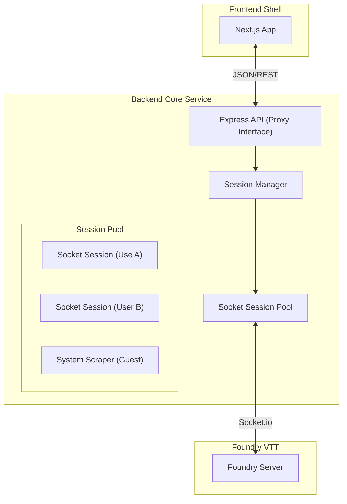

# SheetDelver System Architecture

This document serves as the authoritative source of truth for the SheetDelver architecture. It describes the design principles, structural organization, and decoupled "Core/Shell" model.

## 1. Architectural Philosophy
SheetDelver is designed as a **Headless Client Proxy** for Foundry VTT. It follows a "Clean Architecture" approach, strictly separating business logic from delivery mechanisms.

### Core Principles
- **Multi-User Proxy**: The backend acts as an orchestrator, maintaining multiple individual socket connections to Foundry—one for each authenticated user.
- **Frontend Agnosticism**: The Frontend (UI) never communicates with Foundry directly. It interacts solely with the SheetDelver API. The backend proxies and transforms all data.
- **Stateless Frontend**: The UI assumes no state ownership. It reflects the state provided by the API endpoints.

---

## 2. Decoupled Core/Shell Model

### 2.1 The Core Description
- **Session Manager (`src/core/session`)**:
    - Manages the lifecycle of user sessions.
    - Maps API Tokens (JWT/Session ID) to active `SocketFoundryClient` instances.
    - Handles "Guest" requests via a dedicated System/Scraper instance (read-only/discovery).
- **Socket Session (`src/core/foundry`)**:
    - Represents a single authenticated connection to Foundry.
    - Maintains its own cookies, user ID, and actor cache.

### 2.2 The Delivery Layers
- **Server (`src/server`)**:
    - **Endpoints**:
        - `/api/auth/login`: Authenticates with Foundry, creates a Socket Session, returns an API Token.
        - `/api/data/*`: Validates API Token, retrieves the correct Socket Session, proxies the request.
        - `/api/guest/status`: Returns world availability (Discovery) without session.

---

## 3. Project Structure

| Directory | Layer | Purpose |
| :--- | :--- | :--- |
| `src/core/session/` | **Orchestrator** | Manages multi-user sessions and token mapping. |
| `src/core/foundry/` | **Domain** | `SocketClient` instances (one per user). |
| `src/server/` | **Delivery** | Express API routing requests to specific sessions. |
| `src/app/` | **UI** | Consumes API. Sends Token in headers. |

---

## 4. Key Workflows

### 4.1 Guest / Discovery
1.  Frontend calls `/api/guest/status`.
2.  Backend checks `Settings.yaml` or uses a `SystemScraper` to find active worlds.
3.  Returns `{ status: 'active', world: 'My World' }` or `{ status: 'setup' }`.

### 4.2 Authentication
1.  Frontend POST `/api/auth/login` with `{ username, password }`.
2.  Backend instantiates a new `SocketClient`.
3.  `SocketClient` connects to Foundry and emits `login`.
4.  If successful:
    - Backend generates `authToken`.
    - Stores `authToken` -> `SocketClient` mapping in `SessionManager`.
    - Returns `authToken` to Frontend.
5.  Frontend stores `authToken` (sessionStorage).
6.  **State Machine Transition**:
    - Frontend transitions to `'authenticating'` state (shows loading screen).
    - Polling loops wait for backend session confirmation.
    - Once confirmed, transitions to `'dashboard'` state.
    - This prevents UI flashing during session establishment.

### 4.2.1 Logout
1.  Frontend calls `handleLogout()`.
2.  Frontend transitions to `'login'` state **before** clearing token (prevents flash).
3.  Backend POST `/api/logout` to destroy session.
4.  Frontend clears `authToken` from sessionStorage.
5.  State machine remains on `'login'` screen (smooth transition).

### 4.3 Data Access (Personalized)
1.  Frontend GET `/api/actors` with `Authorization: Bearer <token>`.
2.  Backend middleware extracts `<token>`.
3.  `SessionManager` retrieves the specific `SocketClient` for that user.
4.  `SocketClient` requests Actors (Foundry returns only what this user can see).
5.  Backend normalizes and returns data.

### 4.4 Compendium Fetching (Hybrid)
1.  **HTML Scraping**: `SocketClient` fetches the `/game` page over HTTPS using the authenticated session cookie.
2.  **Pack Discovery**: Parses the `game.data.packs` array from the HTML source to identify available compendiums.
3.  **Index Retrieval**: Uses the Socket.io connection to fetch indices for each identified compendium.
4.  **Rationale**: Direct socket commands for listing all compendiums are unreliable or restricted in Foundry V13 for headless clients.

---

## 5. Security & Isolation
- **No Shared State**: Each user has their own socket. Leakage between users is impossible by design as Foundry enforces permissions per socket connection.
- **Token Based**: API Tokens are the only key to a session.
- **Timeout**: The `SessionManager` should auto-close sockets after inactivity to save resources.

## 6. Ports & Config
- **Frontend**: 3000
- **Backend**: 3001
- **Foundry**: Configurable (e.g. 30000)
