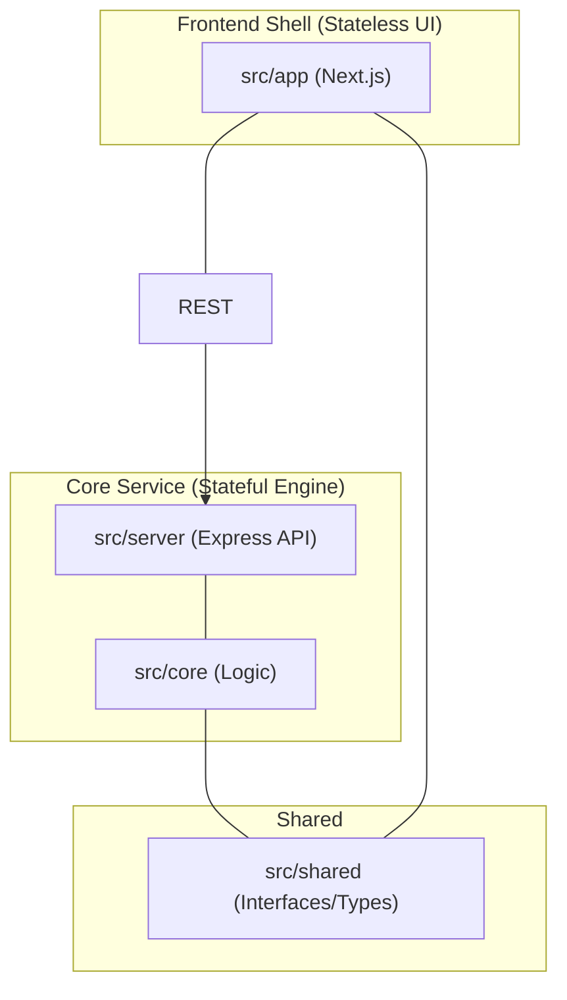

# SheetDelver System Architecture

This document serves as the authoritative source of truth for the SheetDelver architecture. It describes the design principles, structural organization, and decoupled "Core/Shell" model.

## 1. Architectural Philosophy
SheetDelver is designed as a **Headless Client** for Foundry VTT. It follows a "Clean Architecture" approach, strictly separating business logic from delivery mechanisms (Web, CLI, API).

### Core Principles
- **Separation of Concerns**: The "Engine" (Core) is isolated from "Delivery Layers" (App, Server, CLI).
- **Single Source of Truth**: `architecture.md` and `src/shared` define the common language of the system.
- **Headless First**: All logic is driven by a stateful backend service, making the frontend a thin presentation layer.

---

## 2. Decoupled Core/Shell Model

### 2.1 The Core Logic (`src/core`)
- **Role**: The "Engine" of the application. Contains all stateful logic.
- **Responsibilities**:
    - Manage `SocketFoundryClient` connection and protocol.
    - Execute world discovery and scraping.
    - Handle complex data normalization via System Adapters.
    - **No Delivery Knowledge**: This layer does not know about Express or Next.js.

### 2.2 The Delivery Layers
- **Server (`src/server`)**: An Express wrapper around the Core logic. Exposes the App API and Admin API.
- **App (`src/app`)**: A Next.js application that renders the UI and proxies requests to the Server.
- **CLI (`src/cli`)**: An interactive terminal tool for administrative tasks.

### 2.3 The Shared Layer (`src/shared`)
- **Role**: Common ground for all layers.
- **Content**: TypeScript interfaces, constants, and lightweight utilities.
- **Constraint**: This is the only directory that can be imported by both `core` and `app`.

---

## 3. Project Structure (Source of Truth)

| Directory | Layer | Purpose |
| :--- | :--- | :--- |
| `src/core/` | **Domain** | Stateful Foundry logic (Client, Registry, Security). |
| `src/shared/` | **Shared** | Common interfaces, types, and constants. |
| `src/server/` | **Delivery** | Core Service Express API & Lifecycle management. |
| `src/app/` | **Delivery** | Next.js Frontend Shell (UI & API Proxies). |
| `src/app/ui/` | **UI** | React components, hooks, and styles. |
| `src/cli/` | **Delivery** | Admin Console interactive CLI tool. |
| `src/modules/` | **Adapters** | System-specific RPG logic (Shadowdark, etc.). |
| `src/scripts/` | **Tooling** | Startup, Build, and Maintenance utilities. |
| `src/tests/` | **Verification**| Unit and Integration test suites. |

---

## 4. Key Components

### 4.1 `SocketClient.ts` (`src/core/foundry`)
Handles the low-level Foundry v13 handshake, cookie parsing, and socket.io maintenance.

### 4.2 `SystemAdapter` (`src/modules`)
The translation layer mapping raw Foundry JSON to standardized internal models.

### 4.3 `coreFetch` (`src/app/lib`)
The internal proxy utility that allows the Shell to communicate with the Core Service.

---

---

## 6. State Management & Reliability

SheetDelver implements a **Strict Multi-Layer State Machine** to ensure high reliability during unstable network conditions or world transitions (e.g., launching or shutting down a world).

### 6.1 Strict State Separation
1.  **Socket Connection (Network Layer)**: Tracks the physical Socket.io connection.
2.  **World State (Application Layer)**: Tracks world availability (`offline`, `setup`, `startup`, `active`).
3.  **User Session (Identity Layer)**: Tracks authentication (`isLoggedIn`) and persists even during transient socket drops.

### 6.2 UX Reliability
- **Reconnecting Overlay**: When the socket drops but the world is still "Active", the UI displays a non-disruptive overlay. This allows the user to stay on their current view (e.g., a character sheet) while the backend automatically restores the connection.
- **Graceful Transitions**: The state machine prevents "Configuration Errors" by ignoring transient `disconnected` states during world launches, remaining on the Setup screen until the world is definitively ready.
