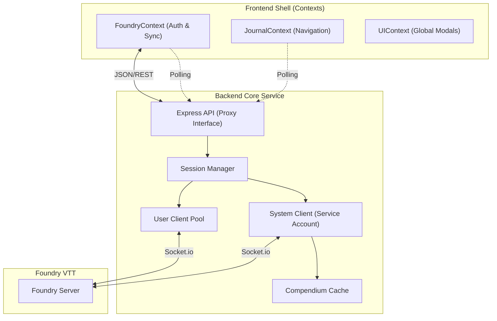

# SheetDelver System Architecture

This document serves as the authoritative source of truth for the SheetDelver architecture. It describes the design principles, structural organization, and decoupled "Core/Shell" model.

## 1. Architectural Philosophy
SheetDelver is designed as a **Headless Client Proxy** for Foundry VTT. It follows a "Clean Architecture" approach, strictly separating business logic from delivery mechanisms.

### Core Principles
- **Dual-Socket Model**: The backend maintains a permanent **System Client** for global world monitoring and a transient **User Client** pool for individual player sessions.
- **Frontend Agnosticism**: The Frontend (UI) never communicates with Foundry directly. It interacts solely with the SheetDelver API.
- **Context-Driven State**: The UI uses React Contexts as the single source of truth, synchronized via periodic polling of the Backend API.

---

## 2. Decoupled Core/Shell Model

### 2.1 The Core Description
- **Session Manager (`src/core/session`)**:
    - Manages the lifecycle of user sessions and maps API Tokens to `ClientSocket` instances.
    - Maintains the **System Client** (`CoreSocket`) for unauthenticated status checks and world monitoring.
- **Foundry Sockets (`src/core/foundry/sockets`)**:
    - **CoreSocket**: A singleton connection acting as a service account. Tracks player lists, world status, and system metadata.
    - **ClientSocket**: A per-user connection. Receives personal notifications (Item sharing, whispered chat) and performs user-authorized writes.
- **Compendium Cache**: A centralized service that pre-processes and caches compendium indices for rapid name resolution and data retrieval.

### 2.2 The Delivery Layers
- **Server (`src/server`)**:
    - **Status Handler**: Aggregates data from both the System Client and the specific User Client to provide a complete view of the world state.
    - **Module Routing**: RegEx-based routing that allows system-specific packages (like Shadowdark) to mount their own API logic dynamically.
    - **Shared Content**: Tracks shared media (images/journals) targeted at the current user.

---

## 3. Frontend Architecture

### 3.1 React Contexts
- **FoundryProvider**: The heart of the application. Manages the connection step (`init` -> `login` -> `dashboard`), authenticates users, and polls for real-time state updates (actors, users, system info).
- **JournalProvider**: Manages journal entry loading, folder hierarchies, and pagination logic. 
- **UIProvider**: Manages the state of global overlays like the sidebars, floating HUD, and shared content modals.

---

## 4. Key Workflows

### 4.1 World Discovery & Status
1.  Frontend polls `/api/status`.
2.  Backend queries the `SystemClient` for world status and active user counts.
3.  If a valid `Authorization` header is present, the backend also checks the specific `UserClient`'s connection state.

### 4.2 Authentication & Handshake
1.  Frontend POST `/api/login`.
2.  Backend creates a new `ClientSocket`, performs the Foundry login handshake, and returns a token.
3.  `FoundryContext` transitions to `'authenticating'` until the next status poll confirms the specific socket session is ready.

### 4.3 Data Normalization
All data returned by the API passes through a **System Adapter**. For example, the `ShadowdarkAdapter` resolves item names from the `CompendiumCache`, calculates encoded inventory slots, and formats roll formulas before the UI ever sees the data.

---

## 5. Security & Isolation
- **Per-User Sockets**: Every user has their own dedicated socket. Foundry's native permission model is enforced at the transport layer.
- **Local Admin API**: Critical world management functions (Launch/Shutdown) are restricted to `localhost` requests only.

## 6. Ports & Config
- **Frontend**: 3000
- **Backend (API)**: 3001
- **Foundry**: Configurable via `settings.yaml`
