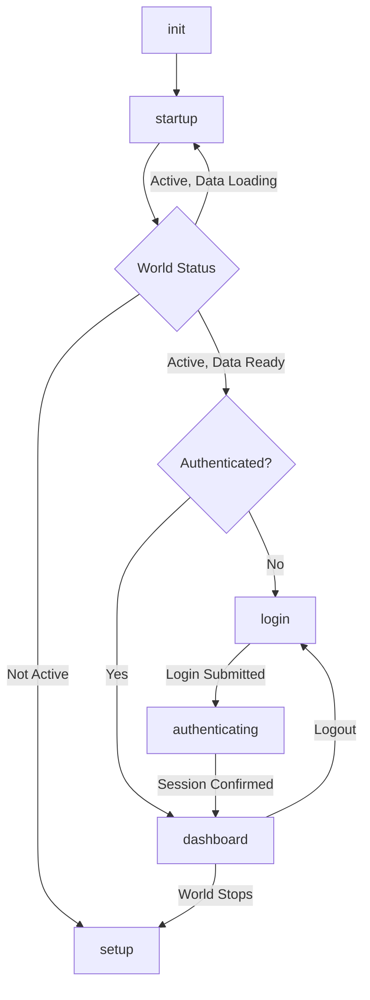

# Reusable UI Components

SheetDelver provides a set of core UI components to ensure consistency across different system sheets. These components are designed to be system-agnostic and themable via the `SystemAdapter`, interfacing with a headless Socket.io backend.

## Notification System (Toast)

A robust toast notification system that supports HTML content (e.g., for dice roll results) and auto-dismissal.

**Path**: `@/components/NotificationSystem`

### Usage

1.  **Initialize Hook**:
    ```tsx
    import { useNotifications, NotificationContainer } from '@/components/NotificationSystem';

    export default function MyPage() {
        const { notifications, addNotification, removeNotification } = useNotifications(5000); // 5s default duration

        return (
            <>
                <button onClick={() => addNotification('Hello!', 'success')}>Notify</button>
                <NotificationContainer notifications={notifications} removeNotification={removeNotification} />
            </>
        );
    }
    ```

2.  **HTML Content**:
    ```tsx
    addNotification('<b>Bold Message</b>', 'info', { html: true });
    ```

## RichTextEditor

A wrapper around Tiptap for editing HTML content (biographies, notes).

**Path**: `@/components/RichTextEditor`

```tsx
<RichTextEditor 
    content={actor.system.notes} 
    onChange={(html) => onUpdate('system.notes', html)} 
/>
```

## ConfirmationModal

A standard modal for destructive actions. Uses React Portal.

**Path**: `@/components/ui/ConfirmationModal`

```tsx
<ConfirmationModal
    isOpen={isOpen}
    onClose={() => setIsOpen(false)}
    onConfirm={handleDelete}
    title="Delete Item?"
    message="Are you sure you want to delete this content?"
    confirmLabel="Delete"
    isDanger={true}
/>
```

## RollDialog

A unified dialog for configuring dice rolls (Ability checks, Attacks, Spells). Supports generic options or system-specific extensions.

**Path**: `@/components/RollDialog`

```tsx
<RollDialog
    isOpen={isOpen}
    onClose={() => setIsOpen(false)}
    onRoll={(options) => onRoll('attack', 'dagger', options)}
    title="Dagger Attack"
    config={{
        modes: ['normal', 'advantage', 'disadvantage'],
        bonuses: ['ability', 'item', 'talent']
    }}
/>
```

## DiceTray

A persistent tray for manual dice rolling. Generally handled by the layout but accessible if needed. Styles can be overridden via `SystemAdapter.componentStyles.diceTray`.

**Path**: `@/components/DiceTray`

```tsx
<DiceTray 
    onSend={(msg) => handleSend(msg)} 
    adapter={currentAdapter} 
/>
```

## GlobalChat

The main chat interface, including the collapsible chat window and dice tray integration. It sits at the layout level usually.

**Path**: `@/components/GlobalChat`

```tsx
<GlobalChat
    messages={messages}
    onSend={handleChatSend}
    adapter={adapter}
    foundryUrl={foundryUrl}
/>
```

## LoadingModal

A unified, full-screen loading overlay to be used whenever a blocking load state is required (e.g., initial connection, loading codex, fetching system data).

**Path**: `@/components/LoadingModal`

```tsx
import LoadingModal from '@/components/LoadingModal';

<LoadingModal 
    message="Loading Codex..." 
    visible={isLoading} 
/>
```


## Reconnecting Overlay

A non-disruptive, full-screen overlay that automatically appears when the socket connection to Foundry is lost while the system is in an "Active" world state. This preserves the current UI context (e.g., an open character sheet) while the backend attempts to reconnect.

**Implementation**: Integrated directly into `ClientPage.tsx`.

```tsx
// Pattern:
{step === 'dashboard' && system?.status !== 'active' && (
  <div className="fixed inset-0 z-[60] ...">
    {/* Reconnecting UI */}
  </div>
)}
```

## ClientPage State Machine

The `ClientPage` component implements a robust state machine to manage UI transitions during authentication, world loading, and logout scenarios. This prevents UI flashing and ensures smooth user experience.

**Implementation**: `src/app/ui/components/ClientPage.tsx`

### States

| State | Description | UI Display |
|:------|:------------|:-----------|
| `init` | Initial page load | Loading spinner |
| `startup` | World is starting or data is loading | Loading spinner with "Starting up..." |
| `setup` | No world available | "No World Available" message |
| `login` | World active, user not authenticated | Login form |
| `authenticating` | Login submitted, waiting for backend session | Loading spinner with "Authenticating..." |
| `dashboard` | User authenticated, world active | Character sheets and dashboard |

### State Transitions



### Key Implementation Details

#### Transitional States
- **`authenticating`**: Prevents polling loops from overriding the login state before backend session is established
- **`startup`**: Shows loading screen while world data is being fetched (prevents showing login with incomplete data)

#### State Machine Logic

The `determineStep()` function centralizes state decision logic:

```typescript
const determineStep = (data: any, currentStep: string) => {
  const status = data.system?.status;
  const isAuthenticated = data.isAuthenticated || false;

  // 1. World not active -> setup
  if (status !== 'active') return 'setup';

  // 2. Authenticating -> wait for confirmation
  if (currentStep === 'authenticating') {
    return isAuthenticated ? 'dashboard' : 'authenticating';
  }

  // 3. Check world data completeness
  const worldTitle = data.system?.worldTitle;
  const hasCompleteWorldData = worldTitle && worldTitle !== 'Reconnecting...';
  if (!hasCompleteWorldData) return 'startup';

  // 4. Authenticated -> dashboard, else login
  return isAuthenticated ? 'dashboard' : 'login';
};
```

#### Polling Protection

Two polling loops (`checkConfig` and `session/connect`) both use the same state machine logic to ensure consistency:

- **`checkConfig` guard**: Skips execution when `step === 'authenticating'`
- **World data check**: Both loops verify world data completeness before transitioning to login

#### Logout Flow

Critical order of operations to prevent UI flash:

```typescript
const handleLogout = async () => {
  // 1. Set step to login FIRST (before clearing token)
  setStepWithLog('login', 'handleLogout', 'User logged out');
  
  // 2. Call logout API
  await fetch('/api/logout', { method: 'POST', headers });
  
  // 3. THEN clear token
  setToken(null);
};
```

### Debugging

The `setStepWithLog()` wrapper provides comprehensive state change logging:

```typescript
const setStepWithLog = (newStep, origin, reason?) => {
  console.log(`[STATE CHANGE] ${timestamp} | ${step} → ${newStep} | Origin: ${origin}`);
  console.trace('State change call stack:');
  setStep(newStep);
};
```

Check browser console for detailed state transition logs including:
- Timestamp
- Source/destination states
- Origin (which function triggered the change)
- Reason for the change
- Full call stack trace
