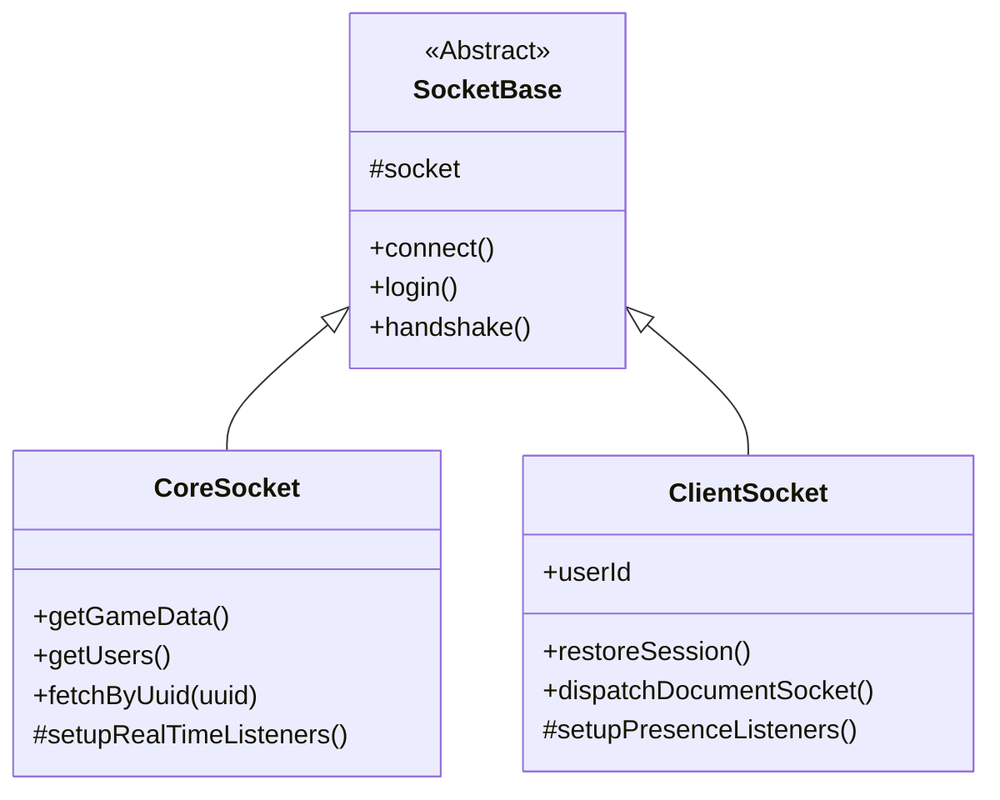

# Foundry V13 Socket Protocol Documentation

This document outlines the socket events and data structures observed for Foundry VTT v13, and details the **SheetDelver Socket Architecture**.

## Architecture Overview

The Socket Architecture uses a hierarchical inheritance model to share connection logic while specializing in data management and presence.



### 1. SocketBase (Abstract)
*   **Role**: Connectivity Hub.
*   **Responsibilities**:
    *   Manages `socket.io` connection lifecycle.
    *   Handles cookie persistence and headers.
    *   Implements high-level `handshake` and `login` workflows.
*   **Key Files**: `src/core/foundry/sockets/SocketBase.ts`

### 2. CoreSocket (Backend Singleton)
*   **Role**: System-level Data Hub.
*   **Responsibilities**:
    *   **fetchByUuid(uuid)**: A high-level helper that resolves any Foundry UUID (World or Compendium) and returns the document data.
    *   **getGameData()**: Fetches World, System, and active User metadata.
    *   Maintains the `userMap` and `gameDataCache` used by the system Status Handler.
*   **Key Files**: `src/core/foundry/sockets/CoreSocket.ts`

### 3. ClientSocket (User Presence)
*   **Role**: Authenticated User Anchor.
*   **Responsibilities**:
    *   **dispatchDocumentSocket(type, action, data)**: The unified method for all CRUD operations. Emits `modifyDocument` (Standard) or `getDocuments` (Compendium) events.
    *   Receives user-specific events (e.g., `shareImage`, `showEntry`).
*   **Key Files**: `src/core/foundry/sockets/ClientSocket.ts`

## Unified Dispatch Model

SheetDelver simplifies Foundry's complex socket protocol into a single interaction pattern:

### Reading Data
```typescript
const response = await client.dispatchDocumentSocket('JournalEntry', 'get', {
    query: { _id: "ID" },
    broadcast: false
});
```

### Writing Data
```typescript
const result = await client.dispatchDocumentSocket('Actor', 'update', {
    updates: [{ _id: "ID", name: "New Name" }],
    broadcast: true
});
```

## Core Events (v13 Discovered)

### `session`
*   **Payload**: `{ "sessionId": "...", "userId": "..." }`
*   **Purpose**: Immediate verification of the socket's authentication state.

### `userActivity`
*   **Payload**: `[ "userId", { "active": boolean, "cursor": {x,y}, ... }]`
*   **Relevance**: Primary signal for real-time presence. Broadcasts `active: false` when a user closes their tab.

### `modifyDocument`
*   **Payload**: `{ "type": "User", "action": "update", "result": [...] }`
*   **Usage**: Real-time updates to user roles, avatars, and names.

## Real-Time Sync Strategy
The `CoreSocket` acts as the master sync node. It listens for all documents of type `User` and updates its internal `userMap`. When the frontend polls `/api/status`, the `CoreSocket` provides the most recent "ground truth" for player counts and active status, even if the user's specific `ClientSocket` hasn't received a presence update yet.
