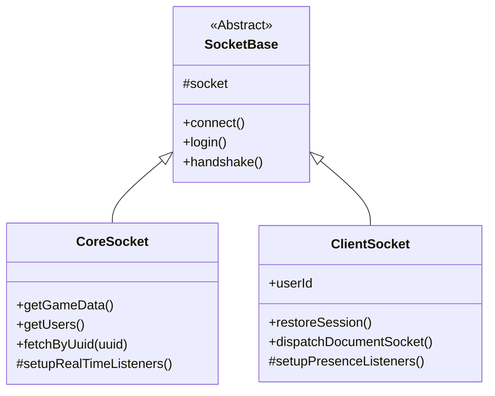

# Foundry V13 Socket Protocol Documentation

This document outlines the socket events and data structures observed for Foundry VTT v13, and details the **SheetDelver Socket Architecture**.

## Architecture Overview

The Socket Architecture uses a hierarchical inheritance model to share connection logic while specializing in data management and presence.

### 1. SocketBase (Abstract)
*   **Role**: Connectivity Hub.
*   **Responsibilities**:
    *   Manages `socket.io` connection lifecycle.
    *   Handles cookie persistence and headers.
    *   Implements high-level `handshake` and `login` workflows.
*   **Key Files**: `src/core/foundry/sockets/SocketBase.ts`

### 2. CoreSocket (Backend Singleton)
*   **Role**: System-level Data Hub.
*   **Responsibilities**:
    *   **fetchByUuid(uuid)**: A high-level helper that resolves any Foundry UUID (World or Compendium) and returns the document data.
    *   **getGameData()**: Fetches World, System, and active User metadata.
    *   Maintains the `userMap` and `gameDataCache` used by the system Status Handler.
*   **Key Files**: `src/core/foundry/sockets/CoreSocket.ts`

### 3. ClientSocket (User Presence)
*   **Role**: Authenticated User Anchor.
*   **Responsibilities**:
    *   **dispatchDocumentSocket(type, action, data)**: The unified method for all CRUD operations. Emits `modifyDocument` (Standard) or `getDocuments` (Compendium) events.
    *   Receives user-specific events (e.g., `shareImage`, `showEntry`).
*   **Key Files**: `src/core/foundry/sockets/ClientSocket.ts`

## Socket Operations & Dispatch Model

SheetDelver relies on two primary methods within `CoreSocket` for communicating with the Foundry VTT server:

### 1. `emitSocketEvent` (Low-Level Pipeline)
*   **Purpose**: A direct wrapper around `socket.io`'s standard `.emit()`. Sends raw, named socket events directly to Foundry's socket server and waits for an acknowledgment/callback.
*   **Usage**: Reserved for highly specific, server-level requests that aren't tied to standard data documents.
    *   `getWorldStatus`: Asking if the server is paused/offline.
    *   `world`: Requesting the massive initial burst of game data.
    *   `getCompendiumIndex` / `getDocuments`: Bulk-reading compendium data.

### 2. `dispatchDocumentSocket` (The Document Workhorse)
*   **Purpose**: The primary way SheetDelver interacts with data. Foundry operates entirely around "Documents" (Actors, Items, ChatMessages, etc.). This method packages a request and sends it via the specific `modifyDocument` socket event.
*   **Payload**: `{ type: "DocumentName", action: "CRUD action", operation: { data: [...] } }`
*   **Foundry Backend Flow**:
    1. Receives `modifyDocument`.
    2. Routes to the correct internal class based on `type`.
    3. Checks permissions for the connected Service Account.
    4. Writes changes to the database (LevelDB).
    5. Broadcasts the `modifyDocument` event to all connected clients to keep caches synced.
*   **Examples**:
    *   **Reading Data**: `dispatchDocumentSocket('JournalEntry', 'get', { query: { _id: "ID" } })`
    *   **Writing Data (e.g. updating Health)**: `dispatchDocumentSocket('Actor', 'update', { updates: [{ _id: "ID", name: "New Name" }] })`
    *   **Sending Chat / Rolls**: `dispatchDocumentSocket('ChatMessage', 'create', { data: [chatData] })`

## Core Events (v13 Discovered)

### `session`
*   **Payload**: `{ "sessionId": "...", "userId": "..." }`
*   **Purpose**: Immediate verification of the socket's authentication state.

### `userActivity`
*   **Payload**: `[ "userId", { "active": boolean, "cursor": {x,y}, ... }]`
*   **Relevance**: Primary signal for real-time presence. Broadcasts `active: false` when a user closes their tab.

### `modifyDocument`
*   **Payload**: `{ "type": "User", "action": "update", "result": [...] }`
*   **Usage**: Real-time updates to user roles, avatars, and names. Also broadcasts document creations and updates to keep all clients in sync.

## Real-Time Sync Strategy & Caching

Because SheetDelver acts as a headless client, it mimics browser behavior to stay up-to-date.
*   **User Sync**: `CoreSocket` acts as the master sync node. It listens for all documents of type `User` and updates its internal `userMap`. When the frontend polls `/api/status`, the `CoreSocket` provides the most recent "ground truth" for player counts and active status.
*   **Document Cache**: When a document change occurs, `_updateActorCache` intercepts the `modifyDocument` broadcast and uses `_deepMerge` to silently patch the local memory representation. This avoids re-fetching the entire Actor on subsequent reads.

## Limitations & Future Considerations

While the current socket implementation is functional, there are several areas of concern and potential improvements for the future:

1.  **Strict Permission Assumptions**: `dispatchDocumentSocket` assumes the headless Service Account has Game Master (or Assistant GM) permissions. If the account is demoted to a standard "Player", operations like fetching all users, reading private GM compendiums, or updating other players' actors will silently fail or return errors.
2.  **Embedded Document Caching Limitations**: The `_updateActorCache` currently focuses on deep-merging updates specifically for `Actor` and `Item` documents. Changes to other embedded documents like `ActiveEffect` or `Token` may cause the local cache to fall out of sync, as explicit deep-merging for those sub-collections is not fully implemented.
3.  **Macro Execution**: There is currently no native way to explicitly execute a macro (e.g., "Execute Macro X") over the socket. To achieve macro-like effects, the headless client must mimic the exact document updates the macro *would* perform.
4.  **Local Roll Evaluation**: `CoreSocket.roll()` evaluates dice math *locally* in the Node.js environment using a replica `Roll` class, and then sends the resulting totals/strings to Foundry as a `ChatMessage`. The server backend is not asked to roll the dice. While this matches standard browser behavior, it means complex Foundry modules that hook deeply into the server's internal rolling sequence might not trigger.
