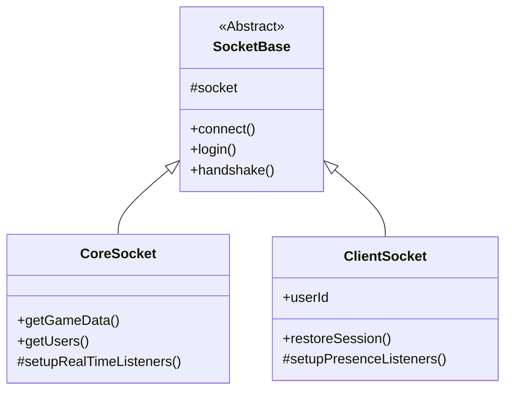

# Foundry V13 Socket Protocol Documentation

This document outlines the socket events and data structures observed for Foundry VTT v13, and details the **SheetDelver Socket Architecture**.

## Architecture Overview

The Socket Architecture uses a hierarchical inheritance model to share connection logic while specializing in data management and presence.

### 1. SocketBase (Abstract)
*   **Role**: Connectivity Hub.
*   **Responsibilities**:
    *   Manages `socket.io` connection lifecycle.
    *   Handles cookie persistence and headers.
    *   Implements the high-level handshake (`handshake`) and login (`login`) workflows.
*   **Key Files**: `src/core/foundry/sockets/SocketBase.ts`

### 2. CoreSocket (Backend Singleton)
*   **Role**: System-level Data Hub.
*   **Responsibilities**:
    *   Authenticates as a Service Account (System-level access).
    *   Fetches and caches global `gameData` (Users, Worlds, Systems).
    *   Listens for global world events (`userConnected`, `userActivity`, `modifyDocument`).
    *   Maintains the `userMap` and `gameDataCache` used by the system Status Handler.
*   **Key Files**: `src/core/foundry/sockets/CoreSocket.ts`

### 3. ClientSocket (User Presence)
*   **Role**: Authenticated User Anchor.
*   **Responsibilities**:
    *   Maintains a direct, authenticated socket connection to Foundry for a specific user.
    *   Handles personal session restoration (`restoreSession`).
    *   Receives user-specific events (e.g., `shareImage`, `showEntry`).
    *   Acts as the context for user data operations.
*   **Key Files**: `src/core/foundry/sockets/ClientSocket.ts`

## Connection Sequences

### Service Account (Boot)
1.  `SocketBase.connect()` -> Establishes transport.
2.  `SocketBase.login()` -> Navigates login form and captures session cookie.
3.  `CoreSocket.getWorldData()` -> Fetches initial state and populates cache.
4.  `setupSharedContentListeners()` -> Registers for shared media events.

### User Session (Login/Restore)
1.  `SocketBase.connect()` -> Establishes transport.
2.  `ClientSocket.restoreSession()` -> Uses existing cookie to bypass login forms.
3.  `handshake()` -> Performs the v13 `session` and `getJoinData` exchange.
4.  `setupPresenceListeners()` -> Monitors user-specific activity and heartbeats.

## Core Events (v13 Discovered)

### `session`
*   **Direction**: Server -> Client
*   **Payload**: `{ "sessionId": "...", "userId": "..." }`
*   **Purpose**: Immediate verification of the socket's authentication state.

### `userActivity`
*   **Direction**: Server -> Client
*   **Payload**: `[ "userId", { "active": boolean, "cursor": {x,y}, ... }]`
*   **Relevance**: Primary signal for real-time presence. Broadcasts `active: false` when a user closes their tab.

### `modifyDocument`
*   **Direction**: Server -> Client
*   **Payload**: `{ "type": "User", "action": "update", "result": [...] }`
*   **Usage**: Real-time updates to user roles, avatars, and names.

### `userConnected` / `userDisconnected`
*   **Reliability**: `userConnected` is stable; `userDisconnected` is often replaced by `userActivity` in v13.

## Real-Time Sync Strategy
The `CoreSocket` acts as the master sync node. It listens for all documents of type `User` and updates its internal `userMap`. When the frontend polls `/api/status`, the `CoreSocket` provides the most recent "ground truth" for player counts and active status, even if the user's specific `ClientSocket` hasn't received a presence update yet.
